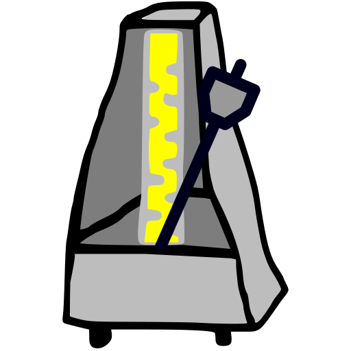

# MetronomeK



Metronome that works and sounds similar to mechanical devices
but with all goods of computer program.

================================================================

## Features:
  - natural (real audio) sounds
  - selectable beat and ring sounds (i.e.: real metronome, clapping, snapping, etc.)
  - possibility to change meter
  - visible counting
  - determining tempo BPM by tapping
  - cross-platform: Android, Linux, Mac, Windows
  - ... see [TODO](TODO.md) for more planed features

================================================================

## Building from sources

**MetronomeK** can be compiled with Qt framework [https://www.qt.io/](https://www.qt.io/).

Under Linux, dev packages (with headers) of ALSA and/or PulseAudio are also required.

To build the application perform (inside sources directory):

```
$cmake .
$make -jX # where X is number of CPU cores
or
$ninja
```
To install it, invoke:

```
$make install
or
$ninja install
```

or, just to simply launch it where it was compiled without installation:

 - invoke once:

    ```
    $make runinplace
    or
    $ninja runinplace
    ```

 - and launch the app this way:

    ```
    $./src/metronomek
    ```
